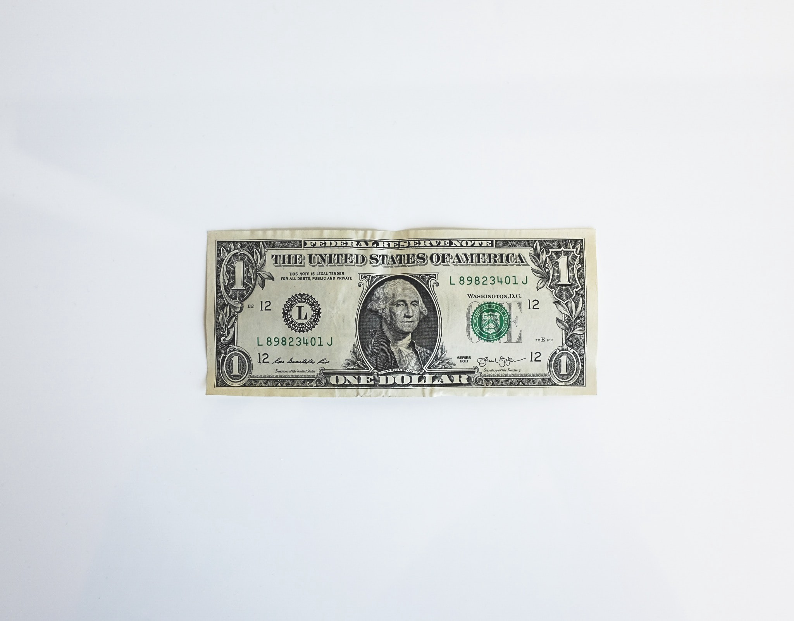
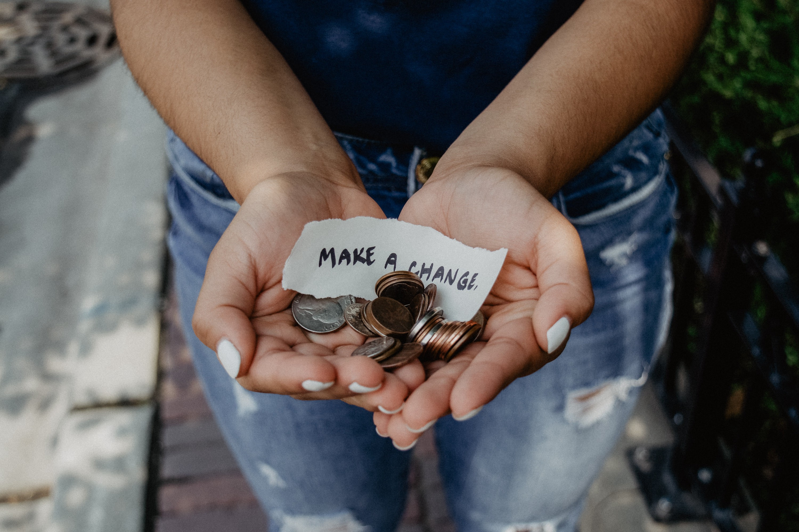
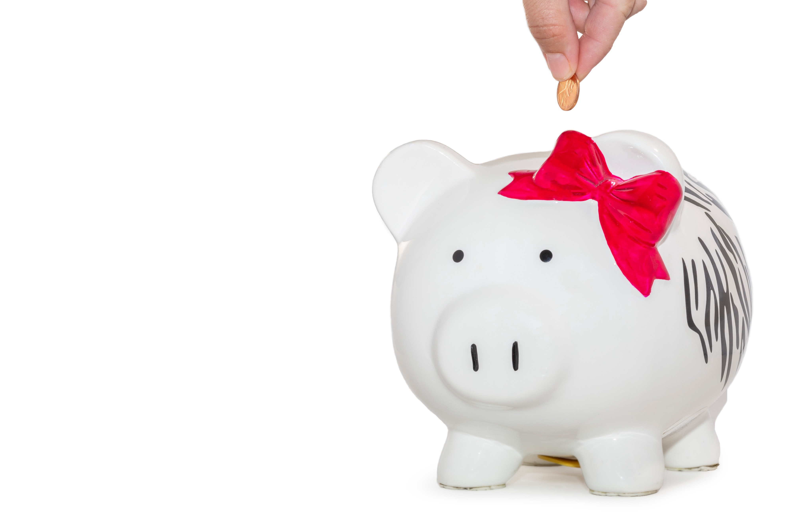
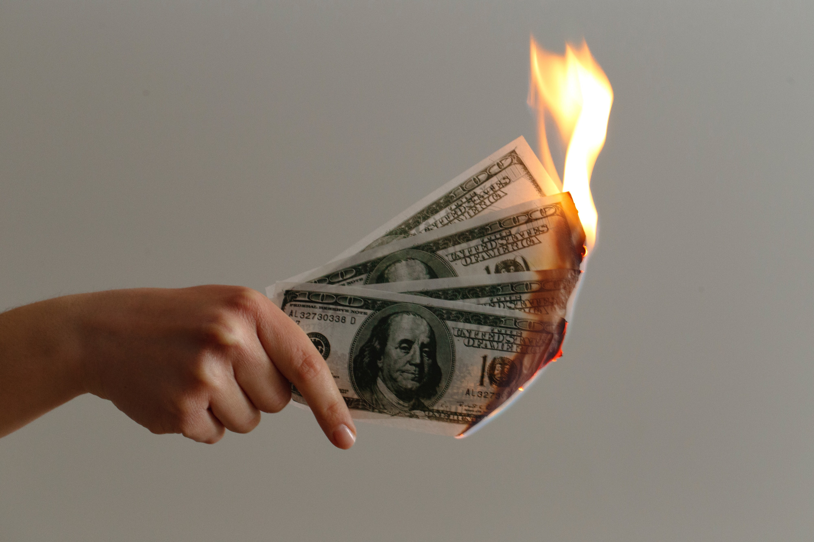

Carlos Eduardo Ortega is a 4th-Year Data Science Student at UC Berkeley. This post was written as an assignment for Professor Cleveland Justis’ UGBA 192E, Social Entrepreneurship, at UC Berkeley’s HAAS School of Business.

---

Corporations will save the world. Now, you may think I am being sarcastic, especially in the age of the [Facebooks](https://www.nytimes.com/2018/03/17/us/politics/cambridge-analytica-trump-campaign.html), or soon to be known as [FACEBOOK](https://www.theverge.com/tldr/2019/11/5/20949650/twitter-ceo-jack-dorsey-facebook-bland-new-logo-mock-tweet), and the [Ubers](https://www.nytimes.com/2017/02/22/technology/uber-workplace-culture.html) of the world, but I do believe that corporations are currently well-poised to initiate large-scale, efficient, and effective improvement on society across the globe.

  

## The Booming Lower-Class
The post-World War II growth of the middle class ended long ago, and the economy has shifted in such a way that the middle class began to shrink decades ago. In a perfect world, the middle class would shrink because the middle class has moved to the upper class. Unfortunately, the complete opposite has been occurring.

In the World Economic Pyramid, there are four tiers. Tier 1, those who make over $20,000 per year, Tier 2 & 3, those who make $1,500 to $20,000 per year, and Tier 4, those who make less than $1,500 per year.

Tier 4 covers a population of over four billion people around the world. To say that there is a gap in wealth between the richest and the poorest of the world is an understatement and market needs to adopt new business models to better serve the needs of the billions of people living in Tier 4. In 1960, the richest 20% of the world was responsible for about 70% of the world’s income. By 2000, that same group was now responsible for [85% of the world’s income](https://www.ide.go.jp/English/Data/Africa_file/Manualreport/bop03.html).

  

## What About Nonprofits?
Historically, for-profit corporations have not been known to be givers. The image of the positive business has been reserved to nonprofits, and many have done great work. One of the most notable being Malaria No More. [On their website](https://www.malarianomore.org/our-impact/progress/), they share that they have prevented over 660 million cases of Malaria and saved over 6 million lives.

However, nonprofits come with some limitations. For starters, many of these nonprofits are mission-driven, like Malaria No More. This means that most of these, if all goes well, will reach a point where their mission has been accomplished and there is no more need for them. At that point, they have two options, to expand their mission or to disband the nonprofit and declaring victory.

Out2Play, a nonprofit dedicated to developing playgrounds for kids in New. York City announced in 2011 that they would be closing down in 2012, leaving enough funds to maintain the parks for years to come. When talking to the [New York Times](https://nyti.ms/2pe1pXr), Out2Play’s chairman, Robert Daum, stated “we just decided to declare victory and go home. Money is a scarce resource, and there are lots of other good causes out there, so there is no point in hitting up our friends and contacts for gifts simply to perpetuate the organization.”

  

## Social Missions for Personal Gain

Despite the good that these nonprofits have done, is it necessary to come in with such a mindset to achieve a net-positive impact on society? Surprisingly, the answer to this, is your insurance. Specifically, America’s largest Health Insurer.

Health Insurers have a very bad reputation, and for good reason. They are known to prioritize their profits over their clients’ health, sometimes putting their lives at risk to save a few dollars. However, UnitedHealth Group Inc. has made some interesting moves in recent years. Dr. Jeffrey Brenner often worked treating the poor and the homeless for over 25 years, now he is an Executive at the aforementioned health insurer.

**Dr. Brenner’s main project? [Giving housing to the homeless.](https://www.bloomberg.com/news/features/2019-11-05/unitedhealth-s-myconnections-houses-the-homeless-through-medicaid)**

Most states outsource their Medicaid programs to insurers like UnitedHealth. Dr. Brenner and his team found that a select group of people with complex combination of medical issues and social factors cost the insurer more money than it takes in. Brenner, motivated by his desire to help people and supported by the fact that this idea would save the company money, has launched housing for these types of patients.

When talking to Bloomberg Businessweek, Brenner shared of a homeless patient who suffers from multiple sclerosis, cerebral palsy, heart disease, and diabetes. UnitedHealth moved the patient into one of their apartments and provided him with health coaching. Since then, their average medical expense per month dropped from $12,945 to $2,073.

  

On the other side of the world, in Bangladesh, is Grameen Bank, founded by Dr. Yunus in 1983. Grameen Bank specializes is providing small loans to the poor to start up their businesses. Often, these loans would be as low as $20. Instead of being backed by capital or assets like traditional loans, Grameen Bank focused on trust and community. By 2006, the Bank had loaned to over 6 million people and had a recovery rate of 98.5% on the loans.

> “Grameen believes that charity is not an answer to poverty. It only helps poverty to continue. It creates dependency and takes away individual’s initiative to break through the wall of poverty. Unleashing of energy and creativity in each human being is the answer to poverty.” — Dr. Yunus

Following this emphasis on using for-profit models to empower the poor, [Grameen Bank had loaned over $5 billion and profited over $15 million in 2005.](https://nyti.ms/2nv4suh)

With cases like these, it is easy to argue that the motivation does not matter. Whether it is power, money, or personal fulfillment, if the end result is a net-positive and it helps people it should be applauded and promoted.

  

## Nothing is Perfect
Despite all the good that nonprofits and for-profit experiments, like the emergence of Microfinance, not all has been positive.

In the [New York Times article referred to earlier](https://nyti.ms/2pe1pXr), the paper had stated that Malaria No More had announced tentative plans to shut down in 2015. However, they later announced that this was no longer the plan and they would continue to work until their mission was accomplished. Malaria No More is currently working with India’s Prime Minister, Narendra Modi, to eradicate malaria in India by 2030. Only time will tell whether this expansion of the mission was out of desire to remain an open and active organization, or if it is a mission coming from a place of desire to help.

When it comes to social missions, nonprofits are often the first to come to mind because they have the image of all being businesses working to improve society. However, just as for-profit corporations are not inherently evil, nonprofits are not inherently good. Take, for example, the College Board. The organization is best known for administering the SAT and AP exams. Both of which are either required by many universities are believed to be required to remain a competitive applicant.

The College Board has been plagued by scandals for many years. One of the most recent being their tumultuous transition from the 2400-point scale exam to the 1600-point scale exam. During this transition, the organization completely reengineered the exam, some argue for the worse, and rushed the process to the extent that they sometimes did not have enough new questions and had to recycle questions. Despite being a nonprofit, in 2017, the College Board had a net income of over [$139 million.](https://projects.propublica.org/nonprofits/organizations/131623965)

Following the success of Dr. Yunus’ microfinance experiment in Bangladesh, many sought to recreate this in other parts of the world. However, the result has been quite the opposite than what was hoped for. Instead of raising people out of poverty, many borrowers that hoped to create their businesses with the [loan now feel trapped](https://www.theguardian.com/global-development/2018/oct/29/loan-sharks-circling-poor-indian-debtors-failed-by-microfinance). Many of these microfinance institutions created rigid repayment structured that did not work well with the borrowers. Now, the priority is no longer becoming independent and successful but just being able to repay this loan that has begun to feel more like a curse than a gift.

  

## A Corporate Future?
Corporations are profit-driven. So, clearly, they will not have the best image. We read the articles of companies restructuring and laying off hundreds of employees at a time without warning, those who opt for lower quality products for higher profit margins, and those whose work culture is not only toxic, but dangerous to its employees.

The list of corporations doing bad things is endless. However, it is this same profit-driven mentality that gives them the potential for as much endless good as endless bad. Nonprofits are limited on many fronts. Their tax status gives them many restrictions and makes them very undesirable to investors. As a result, they often struggle to keep their doors open and, besides a small percentage of nonprofits, they are mostly local in scope. Adding to the issues, the scarce funding makes it hard for them to find strong talent to lead them forward as many of the salaries cannot compete with the private market.

Corporations are free from all these chains. Their inherent drive for profit makes them much more sustainable than a nonprofit and expands their scope to a multinational level. With the growth of the Tier 4 consumer, it is the most opportune time to explore new business models, like Grameen Bank’s, to find a way that empowers consumers while providing them with goods and services.

The lines between company and culture have been blurred over the past decades. As employees spend more and more time at work, they have begun to expect their companies to take stands. Company time is no longer restrained to the traditional 9–5. Lately, employees have expressed their belief that companies can be drivers for social change. To be able to compete with the new demands from consumers and employees, companies need to adapt to the market, and the best way to do so is to engrave a social mission into their business from their inception.