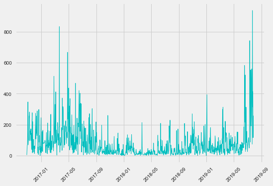
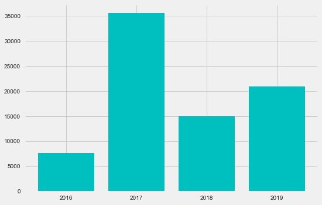
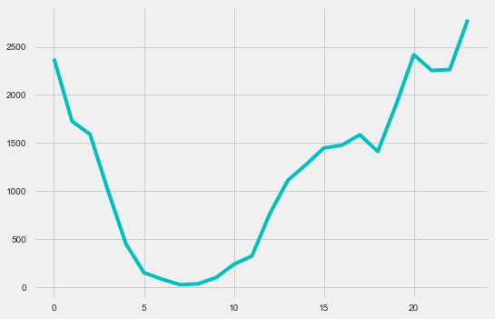
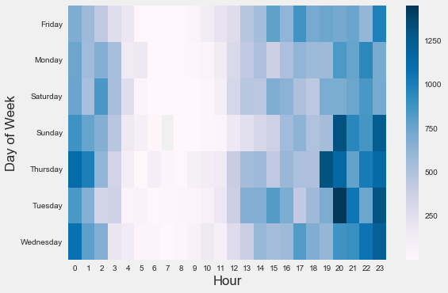
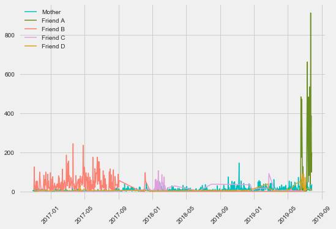
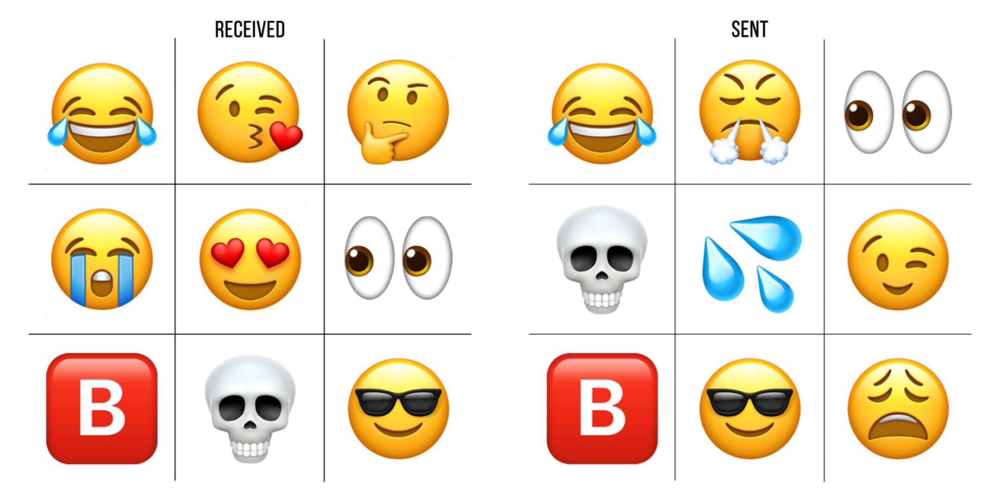
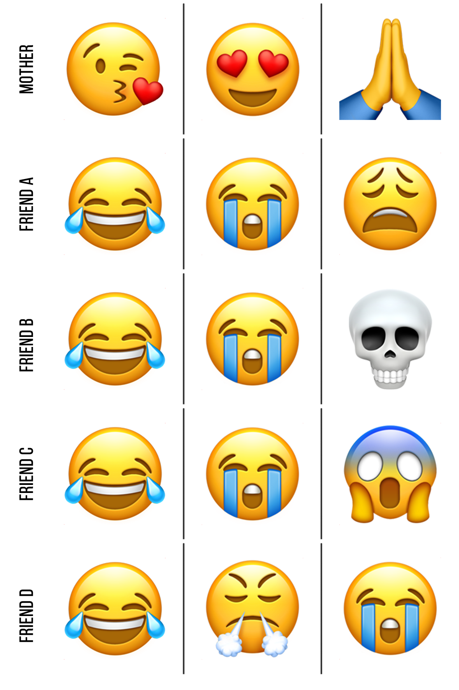

Recently, at work, I have been working with some Natural Language Processing techniques. Which, got me thinking. Is there any way I can use any of these techniques on my conversations.

(Un?)Fortunately, I found that iPhone backups also backup the phone’s chat logs. Following examples from Yorgos Askalidis’s [blog post](https://towardsdatascience.com/heres-how-you-can-access-your-entire-imessage-history-on-your-mac-f8878276c6e9) and inspiration from David Richard Holtz’s [blog post](https://towardsdatascience.com/what-your-imessage-data-says-about-you-daa186db16d), I did some basic analysis on my text messages.

After linking the frames I wanted to work with from the local sqlite3 database, I found I had 78,977 messages saved, the earliest being from October 29, 2016. Plotting the timestamps for all messages gives the following plot:

  

Comparing the total messages per month would not make much sense given that 2019 is not completed and 2016 is not fully contained, so there is a gap from August to October across the years.

  

Plotting the years instead, I found that 2018 was a very bad year for my DMs. 2016 is the lowest, but only 2 full months were included in that year (and even then it was about half of 2018, yikes).

Next up, I decided to look at when I was responding or sending text messages. This is displayed on a 24-hour time format in local time, meaning it was a mixture of Pacific, Eastern and Central Daylight Time.

  

If you ever want me to respond immediately, 6 pm to 1 am is probably the ideal time. I was enjoying the visualizations and insights I found, but I was getting bored with the colors. I decided to find the times my conversations are the most active.

  

I found that I am not exactly having the most thrilling conversations between the hours of 3 am and 1 pm on any given day. Weirdly enough, Tuesdays at 8 pm are the most active days for my conversation. Coincidentally, I have meetings most Tuesdays at 8 pm.

Next up, I decided to plot the conversations between some friends and I, including my mother.

  

Although the results aren’t an accurate portrayal of who I talk to because of the use of other forms of communication, it’s very interesting to see the big picture of my texting activity. Friend B and I’s conversations at the same time we decided to use Messenger, what a coincidence. My conversations with Friend C and D are very sporadic.

If this shows anything, is that no one is more consistent than my mom.

> Shout out to you mom.

Now, we all know that if you want to get to know someone you have to look at their frequently used emojis.

  

To add some granularity, I decided to find the most common emojis in my conversations with my mom and my alphabetical friends.

  

If we can learn anything from these emojis, it’s that I’m a pretty funny guy. Additionally, people appear to cry around me a lot. Probably because of how funny I am (contact my agent for bookings).

If you want to reproduce anything I did or check out some visualizations I did not include here, check out my Jupyter Notebook: [Github Repo](https://github.com/SoyCarloss/iMessage-Analysis).

Next up, I’ll be applying sentiment analysis on my conversations to finally understand what I said wrong and why I was left on read. Maybe even create a chatbot on my messages to automatically reply for me.

The data is the limit.